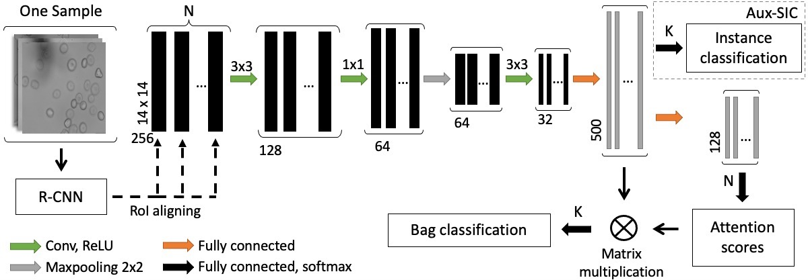

# Attention based Multiple Instance Learning for Classification of Blood Cell Disorders
This repository provides the implementation of the paper [Attention based Multiple Instance Learning for Classification of Blood Cell Disorders](https://link.springer.com/chapter/10.1007/978-3-030-59722-1_24)

## Paper Abstract
Red blood cells are highly deformable and present in various shapes. In blood cell disorders, only a subset of all cells is morphologically altered and relevant for the diagnosis. However, manually labeling of all cells is laborious, complicated and introduces inter-expert variability. We propose an attention based multiple instance learning method to clas- sify blood samples of patients suffering from blood cell disorders. Cells are detected using an R-CNN architecture. With the features extracted for each cell, a multiple instance learning method classifies patient sam- ples into one out of four blood cell disorders. The attention mechanism provides a measure of the contribution of each cell to the overall classi- fication and significantly improves the network’s classification accuracy as well as its interpretability for the medical expert.

## Proposed Architecture
The R-CNN extracts features from the input images and detects the red blood cells. Based on the detected cells a bag of cell features in all of the images is formed after RoI aligning. Passing through convolutional and fully connected layer and attention pooling a feature vector is shaped for the bag and classified. An auxiliary single instance classification (Aux-SIC) branch helps the training during the first steps. N is the number of instances in a bag and K the total number of classes.
<p align="center">

</p>

## Dataset
All images are obtained by an Axiocam mounted on Axiovert 200m Zeiss microscope with a 100x objective. No preprocessing is done and cells are not stained. The data consists of patient samples acquired at different time points, or in different kinds of solutions. In each sample there are 4 - 12 images and each image contains 12 - 45 cells. The dataset contains four genetic mor- phological disorders: Thalassemia (3 patients, 25 samples), sickle cell disease (9 patients, 56 samples), PIEZO1 mutation (8 patients, 44 samples) and hereditary spherocytosis (13 patients, 89 samples). Also we have a healthy control group (26 individuals, 137 samples). We did patient-wise train and test split for a fair test set selection.
Patients previously diagnosed with hereditary spherocytosis were enrolled in the CoMMiTMenT-study (http://www.rare-anaemia.eu/). This study was ap- proved by the Medical Ethical Research Board of the University Medical Center Utrecht, the Netherlands, under reference code 15/426M and by the Ethical Committee of Clinical Investigations of Hospital Clinic, Spain (IDIBAPS) un- der reference code 2013/8436. Genetic cause of the disease was identified by the research group of Richard van Wijk, University Medical Center Utrecht, the Netherlands. The healthy subjects study was approved by the ethics committees of the University of Heidelberg, Germany, (S-066/2018) and of the University of Berne, Switzerland (2018-01766), and was performed according to the Declara- tion of Helsinki.

## Citation

If you use this code, please cite
```
@inproceedings{sadafi2020attention,
  title={Attention based multiple instance learning for classification of blood cell disorders},
  author={Sadafi, Ario and Makhro, Asya and Bogdanova, Anna and Navab, Nassir and Peng, Tingying and Albarqouni, Shadi and Marr, Carsten},
  booktitle={Medical Image Computing and Computer Assisted Intervention--MICCAI 2020: 23rd International Conference, Lima, Peru, October 4--8, 2020, Proceedings, Part V 23},
  pages={246--256},
  year={2020},
  organization={Springer}
}
```
